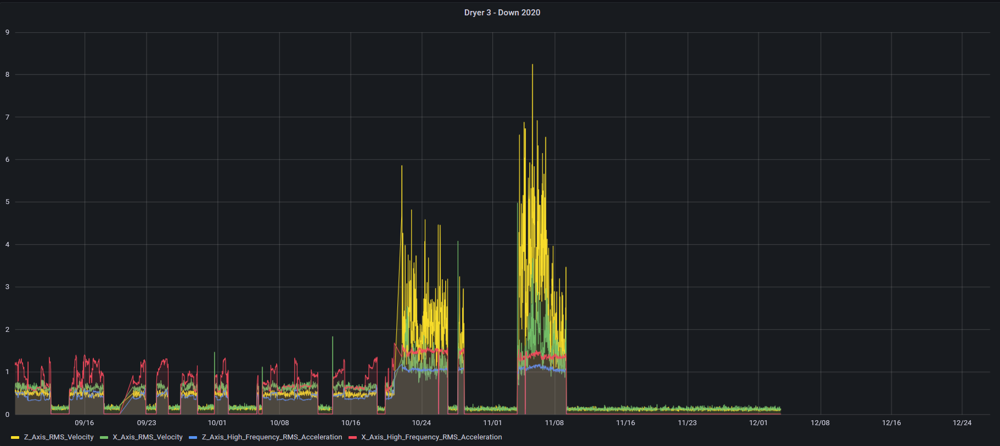
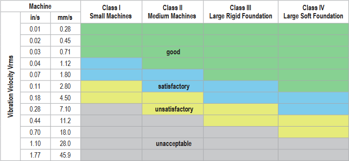
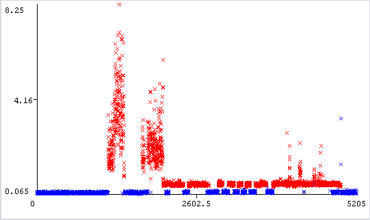
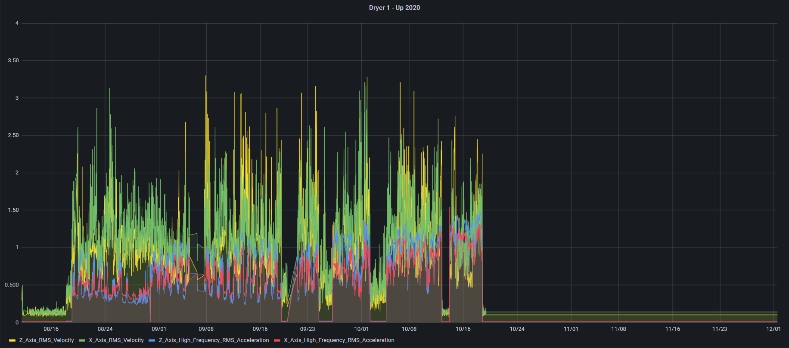
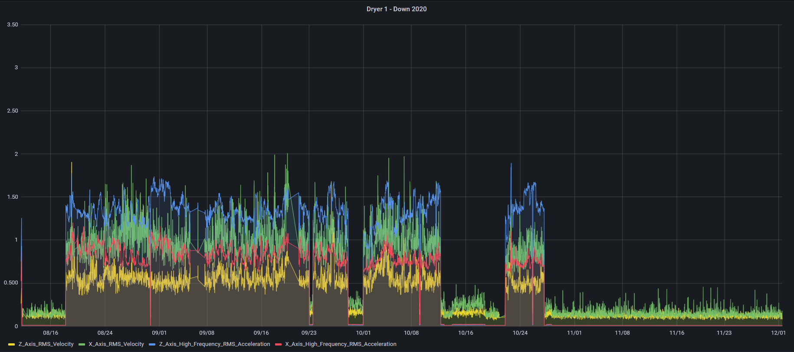

# Vibration Analysis for Predictive Maintenance
## Predictive maintenance
Identify and predict failures in rotating machinery using high frequency vibration data to classify its behavior as normal or anomalous and generating alerts when not all system parameters are known.

## Goals
The goals of the project are: 

- Compare monitored values with the **ISO** standard
- Create a model using differents machine learning techniques

### ISO 10816
**ISO 10816** provides guidance for evaluating vibration velocity severity motors, pumps, fans, compressors, gear boxes, blowers, dryers, presses and other machines that operate in the 10 to 1000 Hz frequency range.

## Machine Learning Algorithms
Some algorithms are evaluated for model creation:

### KMeans

Machine 1 with failure:
- Cluster 0 (blue): good
- Cluster 1 (red): not good

### Autoencoder
Autoencoder can be used as an anomaly detection algorithm when we have a lot of good examples and only a few anomalies trained to minimize reconstruction error.

## System Configuration
The system is composed by:
- Asynchronous motor 110 Kw, 195 A
- Engine pulley
- Fan
- Vibration sensor installed on asynchronous motor

Every 30 minutes are acquired and stored the following measures:
- Z-Axis RMS Velocity (mm/sec)
- X-Axis RMS Velocity (mm/sec)
- Z-Axis High-Frequency RMS Acceleration (G)
- X-Axis High-Frequency RMS Acceleration (G)
- Motor command frequency (Hz)

## Dataset
Data was acquired from 3 twin equipments at the same interval time with different operating conditions.

These graphs show the measured values from 3 different equipments

**Machine 1**

Failures:
- replaced bearing between motor and pulley

**Machine 2**

Failures:
- no failure
 

**Machine 3**

Failures:
- no failure

## Acquisition Equipment

+ Vibration and temperature sensor QM42VT2
+ Compact I/O Module for serial data transmission TBEN-S2-2COM-4DXP

